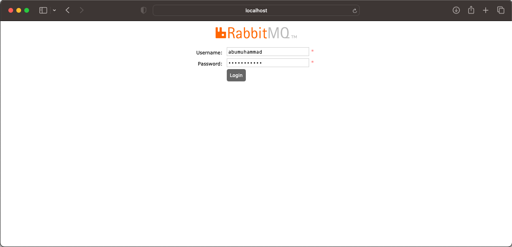
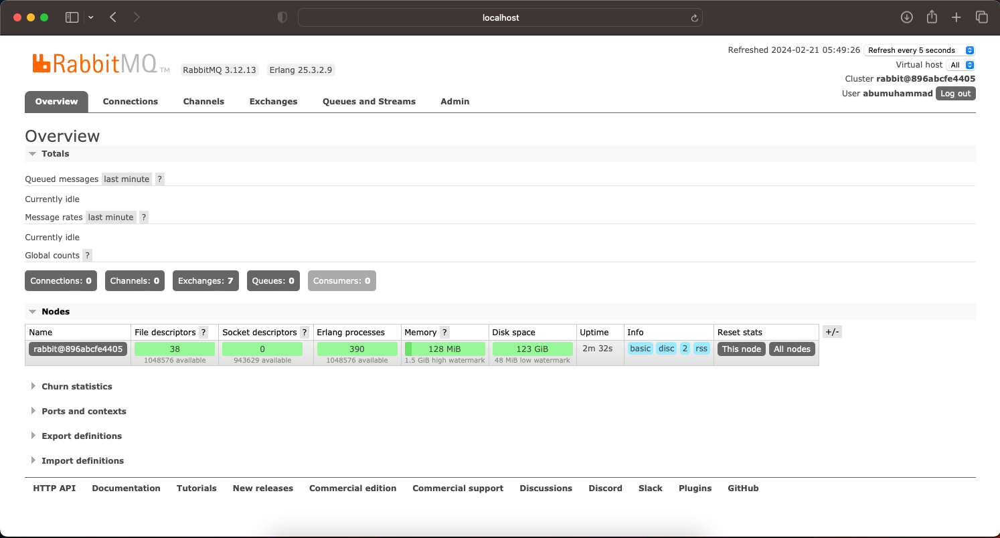

    

# Docker Compose Rabbit MQ
---

### Jalankan command pada Terminal :

    ❯ docker-compose up -d

    ❯ docker ps -a --format "table {{.ID}}\t{{.Image}}\t{{.Status}}\t{{.Names}}\t{{.Ports}}"

    CONTAINER ID   IMAGE                   STATUS         NAMES                 PORTS
    3ec0b90e8718   rabbitmq:3-management   Up 8 minutes   rabbitmq-management   4369/tcp, 5671/tcp, 15671/tcp, 15691-15692/tcp, 25672/tcp, 0.0.0.0:5673->5672/tcp, 0.0.0.0:15673->15672/tcp

### Open Browser
    URL http://localhost:15673

    user : abumuhammad
    password : p4$$woRD123

---

    

    

---

### struktur files :

    ❯ tree -a -L 5 -I 'README.md' -I '*.png' -I '.DS_Store'

    .
    ├── docker-compose.yml
    └── docker-mount
        └── rabbitmq
            ├── .erlang.cookie
            └── mnesia
                ├── rabbit@3ec0b90e8718
                │   ├── DECISION_TAB.LOG
                │   ├── LATEST.LOG
                │   ├── cluster_nodes.config
                │   ├── coordination
                │   ├── msg_stores
                │   ├── node-type.txt
                │   ├── nodes_running_at_shutdown
                │   ├── quorum
                │   ├── rabbit_durable_exchange.DCD
                │   ├── rabbit_durable_exchange.DCL
                │   ├── rabbit_durable_queue.DCD
                │   ├── rabbit_durable_route.DCD
                │   ├── rabbit_runtime_parameters.DCD
                │   ├── rabbit_runtime_parameters.DCL
                │   ├── rabbit_serial
                │   ├── rabbit_topic_permission.DCD
                │   ├── rabbit_user.DCD
                │   ├── rabbit_user.DCL
                │   ├── rabbit_user_permission.DCD
                │   ├── rabbit_user_permission.DCL
                │   ├── rabbit_vhost.DCD
                │   ├── rabbit_vhost.DCL
                │   └── schema.DAT
                ├── rabbit@3ec0b90e8718-feature_flags
                ├── rabbit@3ec0b90e8718-plugins-expand
                └── rabbit@3ec0b90e8718.pid

    8 directories, 24 files
---