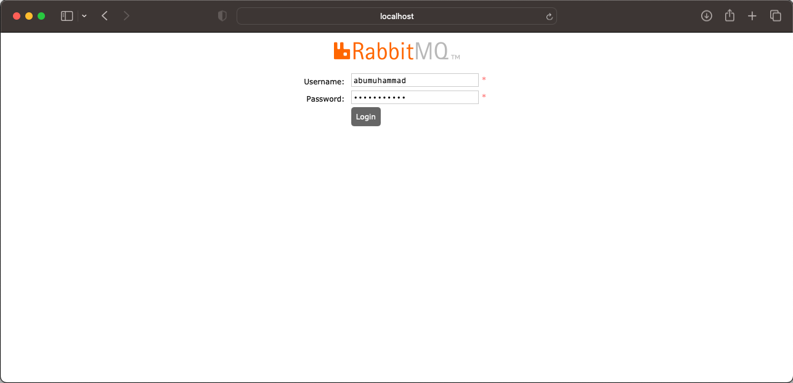
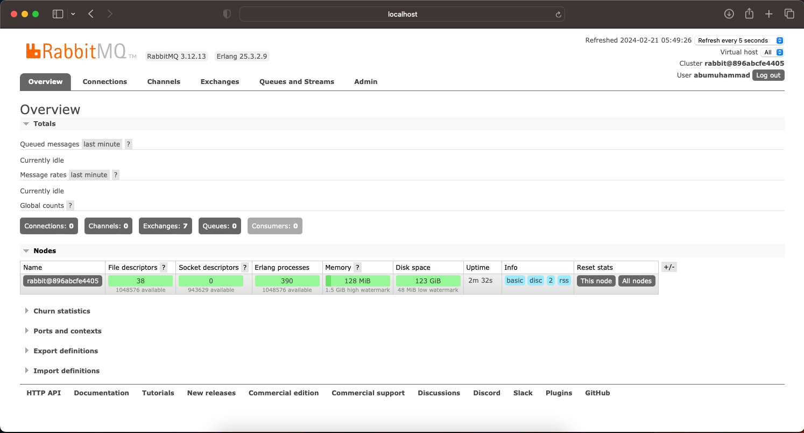

<p align="center">
    
</p>

&nbsp;

## 🪭 Docker Compose Rabbit MQ

```bash
mkdir -p docker-mount/rabbitmq
```

🖋️ file docker-compose.yml
<pre>
❯ vim docker-compose.yml
    . . .
    version: "3"
    services:
      rabbitmq:
        image: "rabbitmq:3-management"
        container_name: "rabbitmq-management"
        ports:
          - "5673:5672"
          - "15673:15672"
        environment:
          RABBITMQ_DEFAULT_USER: "abumuhammad"
          RABBITMQ_DEFAULT_PASS: "password123"
        volumes:
          - ${PWD}/docker-mount/rabbitmq:/var/lib/rabbitmq
</pre>

Jalankan command pada Terminal :
<pre>
❯ docker-compose up -d


❯ docker ps -a --format "table {{.ID}}\t{{.Image}}\t{{.Status}}\t{{.Names}}\t{{.Ports}}"

    CONTAINER ID   IMAGE                   STATUS         NAMES                 PORTS
    3ec0b90e8718   rabbitmq:3-management   Up 8 minutes   rabbitmq-management   4369/tcp, 5671/tcp, 15671/tcp, 15691-15692/tcp, 25672/tcp, 0.0.0.0:5673->5672/tcp, 0.0.0.0:15673->15672/tcp
</pre>

Open Browser
    URL http://localhost:15673

        - user : abumuhammad
        - password : password123

<p align="center">
    
</p>

<p align="center">
    
</p>

&nbsp;

&nbsp;

---

### Struktur files :
<pre>
❯ tree -a -L 5 -I 'README.md' -I '*.png' -I '.DS_Store'

    .
    ├── docker-compose.yml
    └── docker-mount
        └── rabbitmq
            ├── .erlang.cookie
            └── mnesia
                ├── rabbit@3ec0b90e8718
                │   ├── DECISION_TAB.LOG
                │   ├── LATEST.LOG
                │   ├── cluster_nodes.config
                │   ├── coordination
                │   ├── msg_stores
                │   ├── node-type.txt
                │   ├── nodes_running_at_shutdown
                │   ├── quorum
                │   ├── rabbit_durable_exchange.DCD
                │   ├── rabbit_durable_exchange.DCL
                │   ├── rabbit_durable_queue.DCD
                │   ├── rabbit_durable_route.DCD
                │   ├── rabbit_runtime_parameters.DCD
                │   ├── rabbit_runtime_parameters.DCL
                │   ├── rabbit_serial
                │   ├── rabbit_topic_permission.DCD
                │   ├── rabbit_user.DCD
                │   ├── rabbit_user.DCL
                │   ├── rabbit_user_permission.DCD
                │   ├── rabbit_user_permission.DCL
                │   ├── rabbit_vhost.DCD
                │   ├── rabbit_vhost.DCL
                │   └── schema.DAT
                ├── rabbit@3ec0b90e8718-feature_flags
                ├── rabbit@3ec0b90e8718-plugins-expand
                └── rabbit@3ec0b90e8718.pid

    8 directories, 24 files
</pre>

&nbsp;

&nbsp;

&nbsp;

&nbsp;

&nbsp;

&nbsp;

---

Masuk ke dalam container.
<pre>
❯ docker exec -it rabbitmq-management /bin/bash
</pre>
Check baris perintah untuk RabbitMQ server
<pre>
    root@cb1f27838dcd:/# rabbitmqctl --version
    3.13.4
</pre>
<pre>
    root@cb1f27838dcd:/home# rabbitmqctl export_definitions ./backup-test/definition.json
    Exporting definitions in JSON to a file at "./backup-test/definition.json" ...

    root@cb1f27838dcd:/home# ls -lah backup-test/
    total 12K
    drwxr-xr-x 2 root root 4.0K Jul  4 11:44 .
    drwxr-xr-x 1 root root 4.0K Jul  4 11:42 ..
    -rw-r--r-- 1 root root  651 Jul  4 11:44 definition.json
</pre>